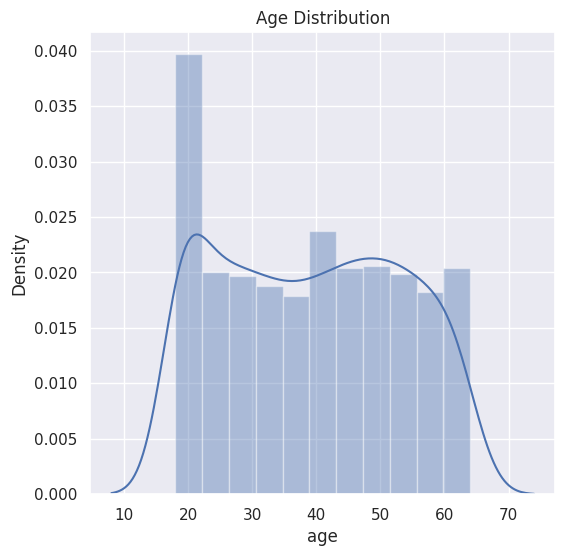
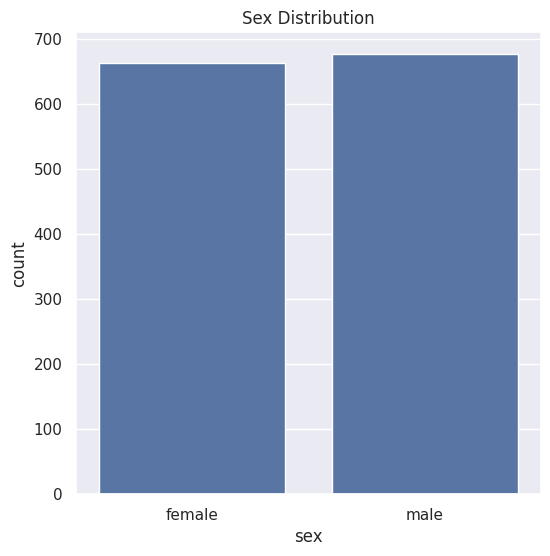
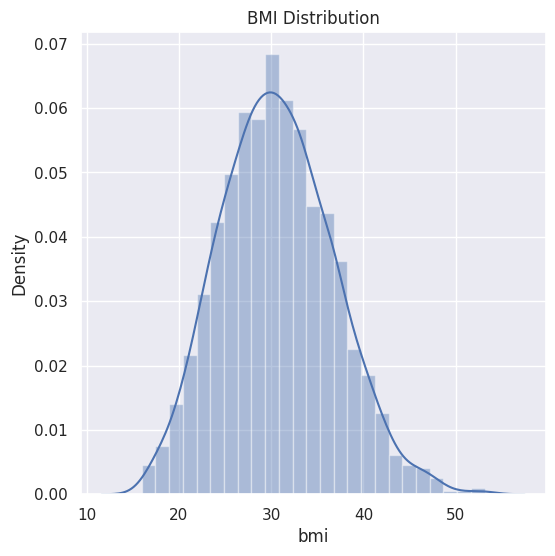
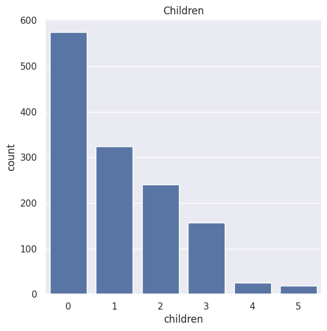
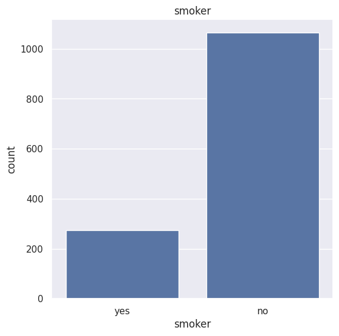
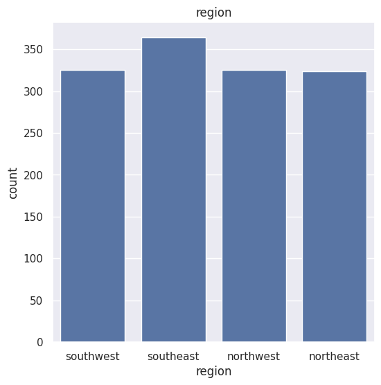
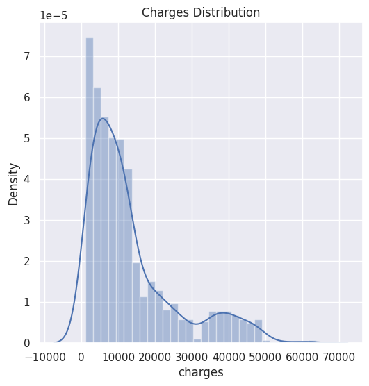

Here's a `README.md` file based on the provided code and data for the insurance price prediction project:


# Insurance Price Prediction

This project aim to predict insurance charges based on various factors such as age, sex, BMI, number of children, smoking status, and region. The model is built using Linear Regression from the scikit-learn library.

## Dataset

The dataset used in this project contains information on insurance charges along with various features:

- `age`: Age of the individual
- `sex`: Gender of the individual (male/female)
- `bmi`: Body Mass Index
- `children`: Number of children/dependents
- `smoker`: Smoking status (yes/no)
- `region`: Region of residence (southeast/southwest/northeast/northwest)
- `charges`: Medical insurance charges

## Requirements

- numpy
- pandas
- matplotlib
- seaborn
- scikit-learn


## Data Analysis and Visualization

The dataset is first analyzed using various statistical measures and visualized using plots to understand the distribution of different features.

 Age Distribution



## Sex Distribution



## BMI Distribution



## Number of Children



## Smoker



## Region



## Charges Distribution



## Data Preprocessing

The categorical columns `sex`, `smoker`, and `region` are encoded to numerical values for model training.

## Model Training

The Linear Regression model is trained on the preprocessed data.

```python
from sklearn.model_selection import train_test_split
from sklearn.linear_model import LinearRegression

# Splitting the data into Training data & Testing Data
X_train, X_test, Y_train, Y_test = train_test_split(X, Y, test_size=0.2, random_state=2)

# Loading the Linear Regression model
regressor = LinearRegression()

# Training the model
regressor.fit(X_train, Y_train)


## Model Evaluation

The model's performance is evaluated using the R-squared value.


## Predictive System

A predictive system is built to estimate insurance costs based on user input.


## Results

- R squared value for training data: 0.7515
- R squared value for test data: 0.7447

## Conclusion

The Linear Regression model performs reasonably well in predicting insurance charges. Future improvements could include trying more complex models and feature engineering to improve the prediction accuracy.

